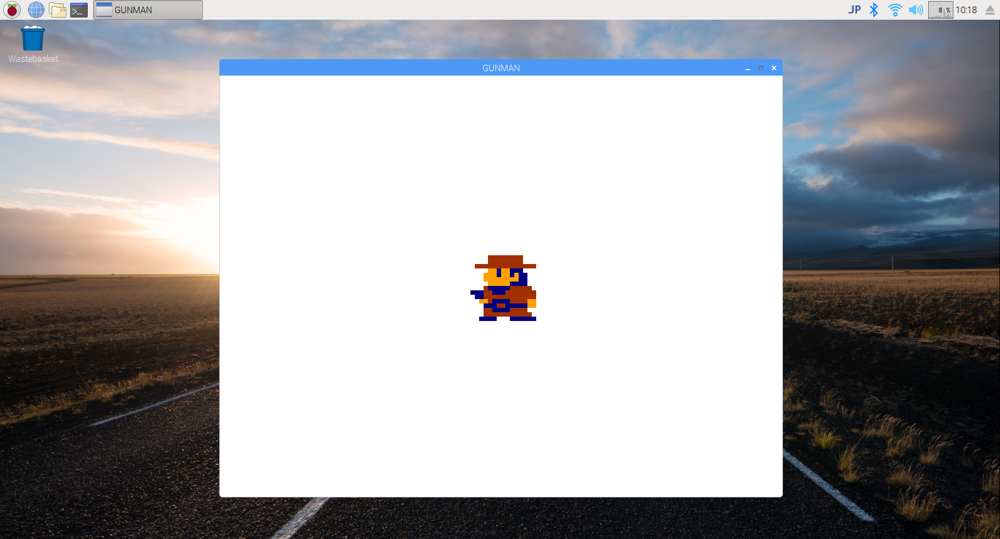

# PyGame wrapper for beginner.

I tested with Raspberry Pi.



## Sample Code

```python
import gamesys

# create new window that title is 'GUNMAN'. default FPS is 2.
game = gamesys.init('GUNMAN', 2)

# load image file. this gunman variable is a PyGame surface object.
gunman = game.load(game.file('gunman01.png'))

while True:
  # draw a surface to center of window.
  game.draw(gunman, 448, 320)

  # update screen.
  game.update()
```
